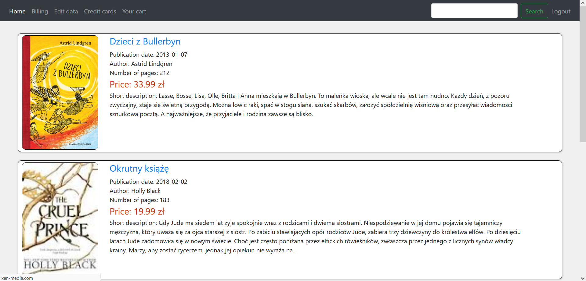

# BookStore
Project meant to remind myself about Spring and Hibernate. Also to use HTML5, CSS3 and Javascript.
## Acquired Knowledge
1) Basic knowledge about Spring.
2) Get the handle of simple authentication using Spring Security.
3) Get more experience with HTML5 and CSS3.
4) Start learning JavaScript and Thymeleaf.
5) Use MySQL Database.
### Sample Images

